# Modern-Web-News-Portal

# 🏗️ System Architecture - Chottola News X

> Complete technical documentation of the bilingual news portal system architecture, data flow, and infrastructure.

[](https://nextjs.org/)
[](https://fastify.dev/)
[](https://www.postgresql.org/)
[](https://vercel.com)
[](https://railway.app)
[](https://neon.tech)
[](https://cloudinary.com)
[](https://vercel.com)
---

## 📊 High-Level Architecture

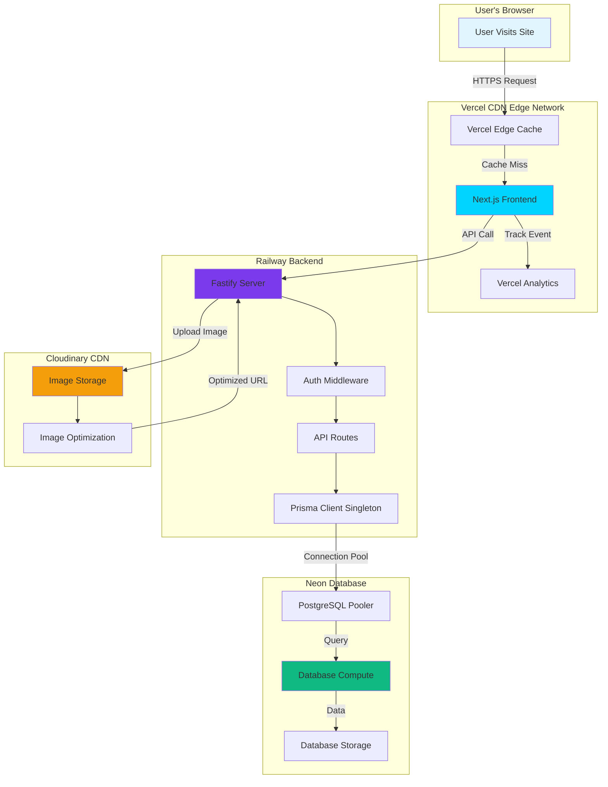

---

## 🔄 Complete User Journey

### When a User Visits Your Site:

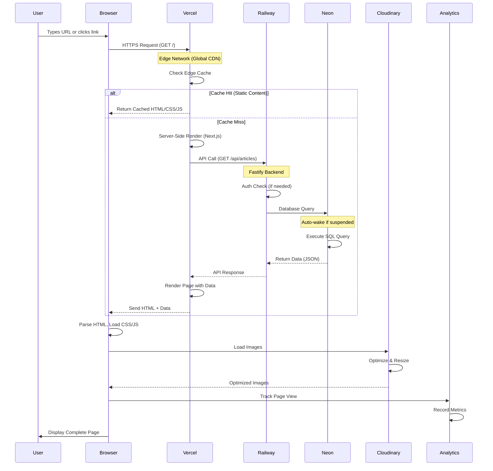

---

## 🎯 Component Architecture

### Frontend (Next.js on Vercel)

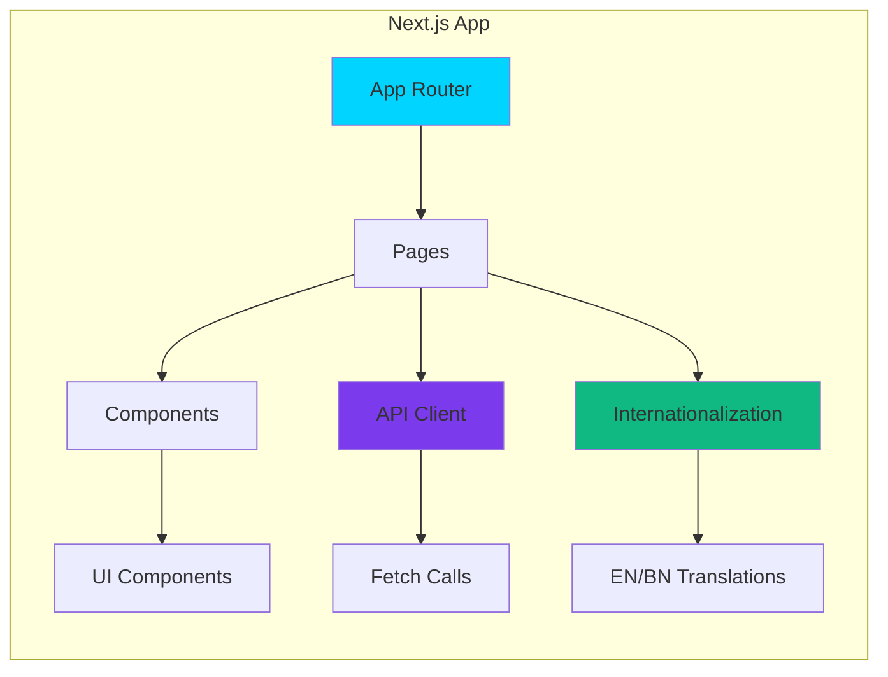

**Technologies:**
- **Next.js 16**: React framework with App Router
- **TypeScript**: Type-safe development
- **Tailwind CSS**: Utility-first styling
- **next-intl**: Internationalization (English/Bengali)

---

### Backend (Fastify on Railway)

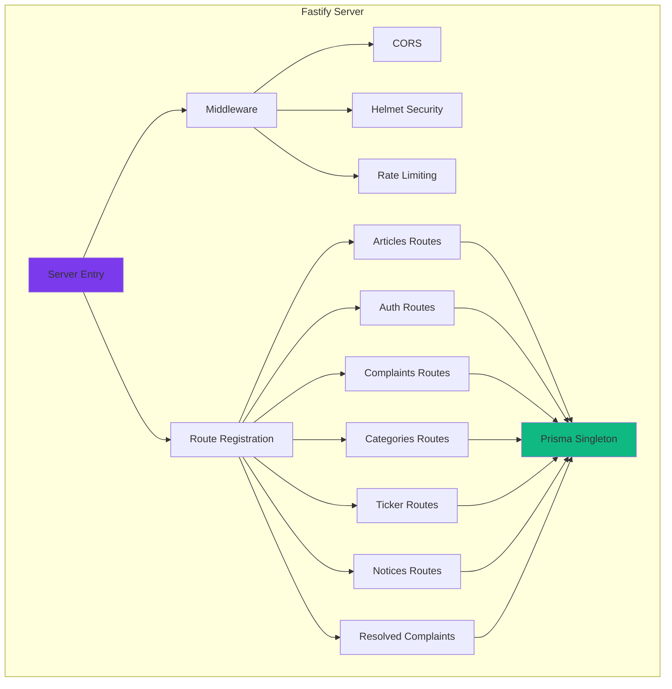

**Technologies:**
- **Fastify**: High-performance Node.js framework
- **Prisma**: Type-safe ORM with singleton pattern
- **JWT**: Stateless authentication
- **bcrypt**: Password hashing

---

### Database (Neon Serverless PostgreSQL)

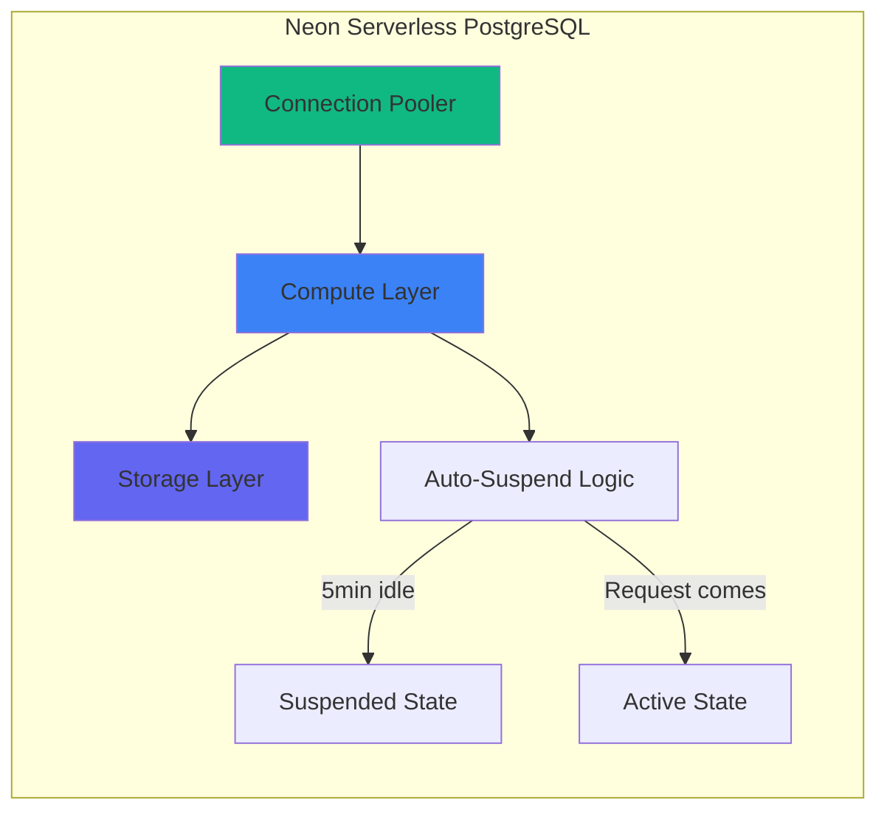

**Key Features:**
- **Auto-suspend**: Reduces costs by 60-70%
- **Connection pooling**: Optimized for serverless
- **Instant wake**: ~1-2 seconds from suspended state

---

## 🚀 Request Flow Example: Reading an Article

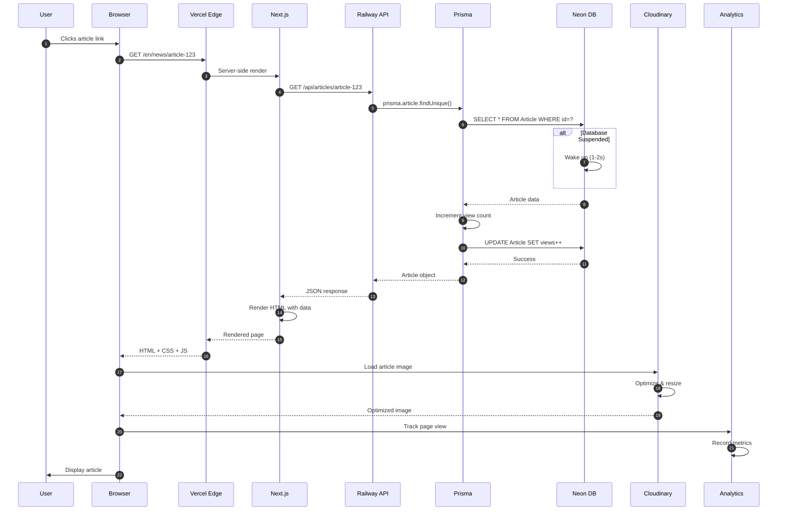

---

## 📁 Project Structure

```
webportalnewslatest/
├── frontend/                    # Next.js Frontend (Vercel)
│   ├── src/
│   │   ├── app/
│   │   │   ├── [locale]/       # Internationalized routes
│   │   │   │   ├── page.tsx    # Homepage
│   │   │   │   ├── news/       # Article pages
│   │   │   │   ├── complaints/ # Complaint system
│   │   │   │   ├── admin/      # Admin dashboard
│   │   │   │   └── ...
│   │   │   ├── layout.tsx      # Root layout + Analytics
│   │   │   └── globals.css     # Global styles
│   │   ├── components/
│   │   │   ├── common/         # Navbar, Footer
│   │   │   └── ui/             # Reusable UI components
│   │   ├── lib/
│   │   │   ├── api.ts          # API client functions
│   │   │   └── types.ts        # TypeScript types
│   │   └── i18n/               # Translations (EN/BN)
│   └── package.json
│
└── backend/                     # Fastify Backend (Railway)
    ├── src/
    │   ├── server.ts           # Main server entry
    │   ├── lib/
    │   │   └── prisma.ts       # Prisma singleton ⭐
    │   ├── routes/
    │   │   ├── articles.ts     # Article CRUD
    │   │   ├── auth.ts         # Login/logout
    │   │   ├── complaints.ts   # Complaint handling
    │   │   └── ...
    │   ├── middleware/
    │   │   └── auth.ts         # JWT verification
    │   └── utils/
    │       └── cloudinary.ts   # Image upload
    ├── prisma/
    │   └── schema.prisma       # Database schema
    └── package.json
```

---

## 🔐 Security Architecture

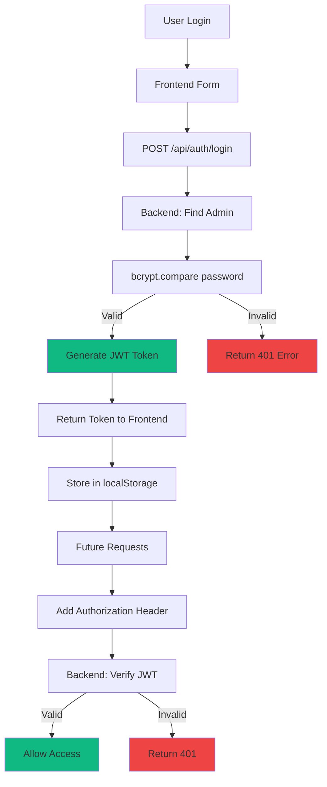

**Security Features:**
- JWT tokens with 7-day expiry
- bcrypt password hashing (10 rounds)
- Rate limiting (500 requests/minute)
- Helmet security headers
- CORS configuration

---

## 💾 Data Flow: Creating an Article

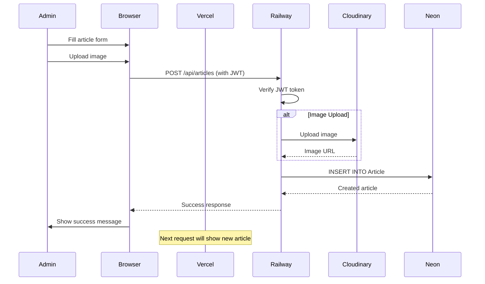

---

## 📊 Monitoring Stack

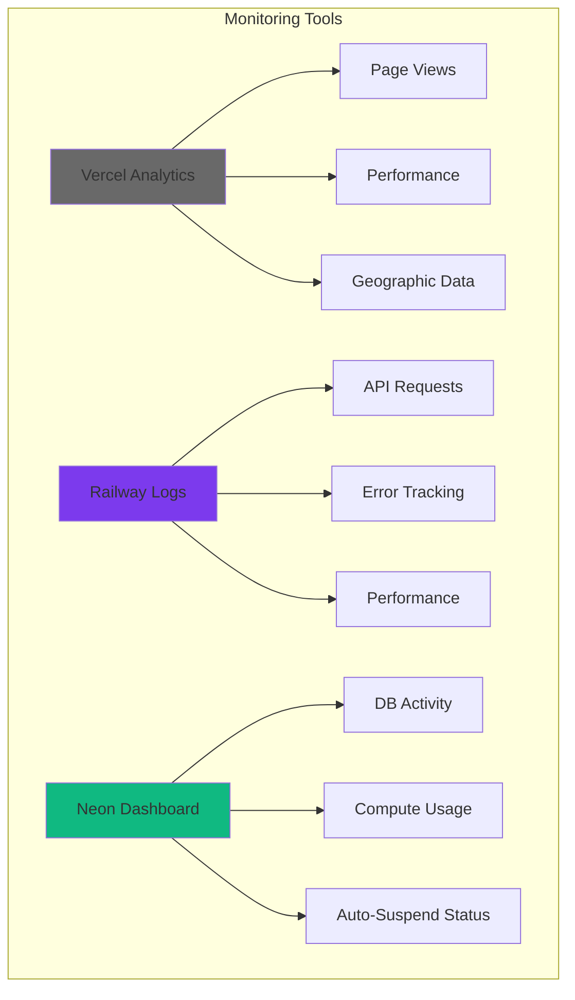

---

## 🌍 Global Infrastructure

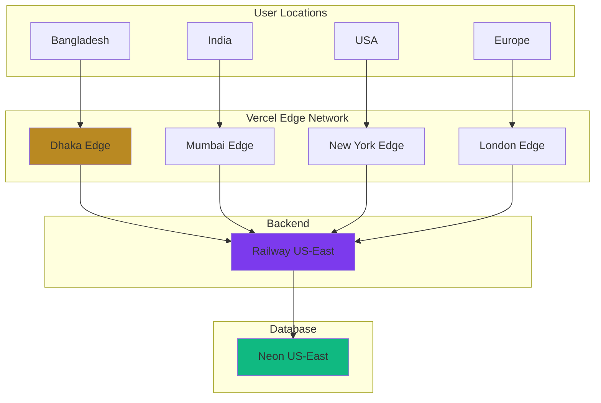

**Infrastructure Details:**
- **Frontend**: Served from nearest Vercel edge (global CDN)
- **Backend**: Railway US-East (single region)
- **Database**: Neon US-East (co-located with backend)
- **Images**: Cloudinary global CDN

---

## 🎯 Key Optimizations

### 1. Prisma Singleton Pattern

**Before:**
```typescript
// ❌ Each route file created its own instance
import { PrismaClient } from '@prisma/client';
const prisma = new PrismaClient();
```

**After:**
```typescript
// ✅ Shared singleton across all routes
import prisma from '../lib/prisma';
```

**Impact:**
- Reduced from 8 instances to 1
- Reduced from 80 potential connections to 1
- Enabled Neon auto-suspend
- **Saved 60-70% on database costs**

### 2. Neon Auto-Suspend

```
Traffic Pattern:
├─ Peak Hours (10 AM - 10 PM): Active (12 hours)
└─ Off-Peak (10 PM - 10 AM): Suspended (12 hours)

Cost Reduction: 50%+ savings
```

### 3. Vercel Edge Caching

- **Static Assets**: Cached at edge (instant delivery)
- **Dynamic Pages**: Server-rendered, then cached
- **API Calls**: Not cached (always fresh data)

### 4. Cloudinary Optimization

```
Original Image: 2MB
↓ Cloudinary Processing
Optimized WebP: 200KB (90% smaller!)
↓ CDN Distribution
Delivered from nearest node
```

---

## 🚀 Deployment Pipeline

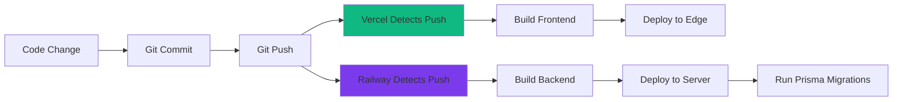

**Automatic Deployment Features:**
- Zero-downtime deployments
- Automatic rollback on failure
- Environment-specific builds
- Database migration automation

---

## 📈 Scaling Strategy

### Current Setup (0-5K visitors/day)

```yaml
Frontend: Vercel (unlimited scale)
Backend: Railway Hobby ($5/mo)
Database: Neon Free (1 connection)
Total Cost: $5-10/month
```

### Medium Traffic (5K-20K visitors/day)

```yaml
Frontend: Vercel (unlimited scale)
Backend: Railway Pro ($20/mo)
Database: Neon Pro (10 connections)
Caching: Redis (optional)
Total Cost: $40-60/month
```

### High Traffic (20K-100K visitors/day)

```yaml
Frontend: Vercel (unlimited scale)
Backend: Railway Pro + Load Balancer
Database: Neon Scale (dedicated compute)
Caching: Redis + Read Replicas
Total Cost: $150-250/month
```

---

## 💰 Cost Breakdown

| Service | Tier | Monthly Cost | Purpose |
|---------|------|--------------|---------|
| **Vercel** | Hobby | Free | Frontend hosting & CDN |
| **Railway** | Hobby | $5 | Backend API server |
| **Neon** | Free | Free-$8 | PostgreSQL database |
| **Cloudinary** | Free | Free | Image storage & CDN |
| **Vercel Analytics** | Free | Free | Traffic analytics |

**Total: $5-15/month** for a production news portal! 🎉

---

## 🛠️ Tech Stack Summary

### Frontend
- **Framework**: Next.js 16 (App Router)
- **Language**: TypeScript
- **Styling**: Tailwind CSS
- **i18n**: next-intl (English/Bengali)
- **Deployment**: Vercel

### Backend
- **Framework**: Fastify
- **Language**: TypeScript
- **ORM**: Prisma (singleton pattern)
- **Auth**: JWT + bcrypt
- **Deployment**: Railway

### Database
- **Type**: PostgreSQL 15
- **Provider**: Neon (serverless)
- **Features**: Auto-suspend, connection pooling

### Infrastructure
- **CDN**: Vercel Edge Network
- **Images**: Cloudinary
- **Analytics**: Vercel Analytics
- **Monitoring**: Railway + Neon dashboards

---

## 📚 Additional Resources

- [Project Documentation](./project_documentation.md)
- [Neon Optimization Guide](./neon_optimization_guide.md)
- [Client Handover Guide](./client_handover.md)

---

## 📝 License

This project is proprietary and confidential.

---

**Built with ❤️ using Next.js, Fastify, and PostgreSQL**
