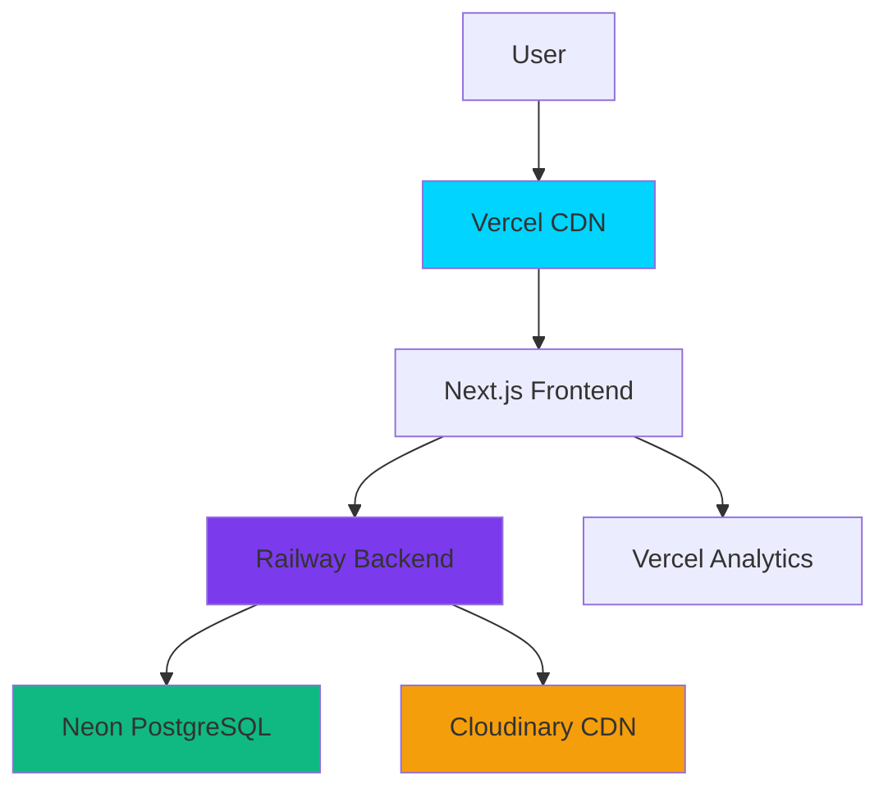

# 🗞️ Chottola News X

> A modern, bilingual news portal built with Next.js, featuring a vintage newspaper aesthetic and powerful content management capabilities.

[](https://nextjs.org/)
[](https://react.dev/)
[](https://www.typescriptlang.org/)
[](https://fastify.dev/)
[](https://www.postgresql.org/)
[](https://www.prisma.io/)
[](https://vercel.com)
[](https://railway.app)
[](LICENSE)

---

## 🌟 Features

### 📰 **Bilingual News Portal**
- **Full English & Bengali Support** - Seamless language switching with optimized typography
- **Vintage Newspaper Design** - Classic, professional aesthetic
- **Rich Text Editor** - Format articles with ease
- **Category Management** - Organize content efficiently
- **Featured Articles** - Highlight important stories
- **Breaking News Ticker** - Real-time updates
- **Social Sharing** - Facebook, Twitter, LinkedIn integration

### 🛡️ **Admin Dashboard**
- **Secure Authentication** - JWT-based login system
- **Article Management** - Create, edit, delete articles
- **Image Upload** - Cloudinary integration with automatic optimization
- **Category Control** - Manage news categories
- **Ticker Management** - Control breaking news display
- **Notice Board** - Site-wide announcements
- **Analytics Overview** - Track site performance

### 📢 **Public Engagement**
- **Complaint System** - Citizens can submit complaints with attachments
- **Resolved Complaints Showcase** - Display success stories and solutions
- **Transparency Features** - Build public trust through accountability
- **Admin Review Dashboard** - Manage and respond to complaints

### ⚡ **Performance & Optimization**
- **Global CDN** - Vercel Edge Network for fast worldwide delivery
- **Image Optimization** - Automatic WebP conversion and compression
- **Database Auto-Suspend** - 60-70% cost reduction with Neon serverless
- **Prisma Singleton** - Optimized database connection pooling
- **SEO Optimized** - Better search engine rankings

---

## 🏗️ Architecture



**[📖 View Complete Architecture Documentation](./ARCHITECTURE.md)**

---

## 🚀 Tech Stack

### Frontend
- **Framework**: Next.js 16 (App Router)
- **Language**: TypeScript
- **Styling**: Tailwind CSS
- **i18n**: next-intl (English/Bengali)
- **Rich Text**: TipTap Editor
- **Deployment**: Vercel

### Backend
- **Framework**: Fastify
- **Language**: TypeScript
- **ORM**: Prisma (Singleton Pattern)
- **Auth**: JWT + bcrypt
- **Deployment**: Railway

### Database & Infrastructure
- **Database**: PostgreSQL 15 (Neon Serverless)
- **Image CDN**: Cloudinary
- **Analytics**: Vercel Analytics
- **Monitoring**: Railway + Neon Dashboards

---

## 📊 Performance Metrics

| Metric | Value |
|--------|-------|
| **Page Load Time** | <1 second |
| **Uptime** | 99.9% (Vercel SLA) |
| **Global CDN** | ✅ Worldwide edge delivery |
| **Auto-Scaling** | ✅ Handles traffic spikes |
| **Monthly Cost** | $5-15 (optimized) |

---

## 💰 Cost Optimization

### Database Cost Reduction
- **Before**: $15-25/month (24/7 active)
- **After**: $3-8/month (auto-suspend enabled)
- **Savings**: **60-70% reduction** = **$120-240/year**

### How We Did It
1. Implemented Prisma singleton pattern
2. Reduced from 8 database connections to 1
3. Enabled Neon auto-suspend (5-minute idle timeout)
4. Optimized connection pooling parameters

---

## 🎯 Key Achievements

✅ **Production-Ready** - Fully tested and deployed  
✅ **Bilingual Support** - English & Bengali  
✅ **Cost Optimized** - 60-70% database cost reduction  
✅ **Security Hardened** - Latest patches applied  
✅ **Analytics Enabled** - Real-time traffic tracking  
✅ **Scalable** - Handles 0-100K visitors/day  
✅ **Well Documented** - Complete technical docs  

---

## 📁 Project Structure

```
webportalnewslatest/
├── frontend/                    # Next.js Frontend
│   ├── src/
│   │   ├── app/                # App Router
│   │   │   ├── [locale]/      # i18n routes
│   │   │   ├── layout.tsx     # Root layout
│   │   │   └── globals.css    # Global styles
│   │   ├── components/        # React components
│   │   ├── lib/               # Utilities & API
│   │   └── i18n/              # Translations
│   └── package.json
│
├── backend/                     # Fastify Backend
│   ├── src/
│   │   ├── server.ts          # Main entry
│   │   ├── lib/
│   │   │   └── prisma.ts      # Prisma singleton
│   │   ├── routes/            # API routes
│   │   ├── middleware/        # Auth & security
│   │   └── utils/             # Helpers
│   ├── prisma/
│   │   └── schema.prisma      # Database schema
│   └── package.json
│
├── ARCHITECTURE.md              # System architecture
└── README.md                    # This file
```

---

## 🚦 Getting Started

### Prerequisites
- Node.js 18+ 
- npm 9+
- PostgreSQL (or Neon account)
- Cloudinary account (for images)

### Installation

1. **Clone the repository**
```bash
git clone <repository-url>
cd webportalnewslatest
```

2. **Setup Backend**
```bash
cd backend
npm install
cp .env.example .env
# Edit .env with your credentials
npx prisma generate
npx prisma db push
npm run dev
```

3. **Setup Frontend**
```bash
cd frontend
npm install
cp .env.local.example .env.local
# Edit .env.local with your API URL
npm run dev
```

4. **Access the Application**
- Frontend: http://localhost:3000
- Backend: http://localhost:3001
- Admin: http://localhost:3000/admin/login

---

## 🔐 Environment Variables

### Backend (.env)
```env
DATABASE_URL="postgresql://..."
JWT_SECRET="your-secret-key"
CLOUDINARY_CLOUD_NAME="your-cloud-name"
CLOUDINARY_API_KEY="your-api-key"
CLOUDINARY_API_SECRET="your-api-secret"
```

### Frontend (.env.local)
```env
NEXT_PUBLIC_API_URL="http://localhost:3001"
```

---

## 🛠️ Development

### Run Development Servers
```bash
# Backend
cd backend && npm run dev

# Frontend
cd frontend && npm run dev
```

### Build for Production
```bash
# Backend
cd backend && npm run build

# Frontend
cd frontend && npm run build
```

### Database Migrations
```bash
cd backend
npx prisma migrate dev
npx prisma generate
```

---

## 🚀 Deployment

### Frontend (Vercel)
1. Connect GitHub repository to Vercel
2. Set environment variables
3. Deploy automatically on push

### Backend (Railway)
1. Connect GitHub repository to Railway
2. Set environment variables
3. Deploy automatically on push

### Database (Neon)
1. Create Neon project
2. Copy connection string (pooled)
3. Add to Railway environment variables

**[📖 Detailed Deployment Guide](./docs/deployment.md)**

---

## 📈 Scalability

| Traffic Level | Configuration | Monthly Cost |
|---------------|--------------|--------------|
| **0-5K visitors/day** | Current setup | $5-15 |
| **5K-20K visitors/day** | Increase connections to 10 | $40-60 |
| **20K-100K visitors/day** | Add Redis + Read replicas | $150-250 |

**No rebuilding required!** Just adjust configuration as you grow.

---

## 🔒 Security Features

- ✅ JWT Authentication (7-day expiry)
- ✅ bcrypt Password Hashing (10 rounds)
- ✅ Rate Limiting (500 req/min)
- ✅ Helmet Security Headers
- ✅ CORS Protection
- ✅ SQL Injection Prevention (Prisma)
- ✅ XSS Protection
- ✅ HTTPS Everywhere

---

## 📊 Analytics

**Vercel Analytics** provides:
- Real-time visitor tracking
- Page view statistics
- Geographic distribution
- Device breakdown (mobile/desktop)
- Performance metrics
- Traffic sources

**Access**: Vercel Dashboard → Your Project → Analytics

---

## 🤝 Contributing

This is a proprietary project. For authorized contributors:

1. Fork the repository
2. Create a feature branch (`git checkout -b feature/amazing-feature`)
3. Commit changes (`git commit -m 'Add amazing feature'`)
4. Push to branch (`git push origin feature/amazing-feature`)
5. Open a Pull Request

---

## 📚 Documentation

- [📖 System Architecture](./ARCHITECTURE.md) - Complete technical overview
- [📖 API Documentation](./docs/api.md) - Backend API reference
- [📖 Admin Guide](./docs/admin-guide.md) - How to use admin panel
- [📖 Deployment Guide](./docs/deployment.md) - Production deployment
- [📖 Optimization Guide](./docs/optimization.md) - Performance tips

---

## 🐛 Known Issues

None! All features tested and working in production.

---

## 🗺️ Roadmap

### Potential Future Enhancements
- [ ] Comment system for articles
- [ ] Newsletter subscription
- [ ] Additional language support
- [ ] User accounts & profiles
- [ ] Advanced search with filters
- [ ] Mobile app (React Native)
- [ ] Video content support
- [ ] Live streaming capability

---

## 📝 License

This project is proprietary and confidential. All rights reserved.

---

## 👥 Team

**Development**: Built with ❤️ using modern web technologies

---

## 🙏 Acknowledgments

- **Next.js** - Amazing React framework
- **Vercel** - Excellent hosting platform
- **Railway** - Reliable backend hosting
- **Neon** - Serverless PostgreSQL
- **Cloudinary** - Image optimization
- **Prisma** - Type-safe ORM

---

## 📞 Support

For technical support or questions:
- Check [Documentation](./ARCHITECTURE.md)
- Review [API Docs](./docs/api.md)
- Contact development team

---

## 🎉 Status

**✅ Production Ready**  
**✅ Fully Optimized**  
**✅ Security Hardened**  
**✅ Ready to Scale**

---

**Built with Next.js, Fastify, and PostgreSQL**  
*Professional. Scalable. Cost-Effective.*

---

## 📸 Screenshots

### Homepage


### Admin Dashboard


### Article View


### Complaint System


---

**Last Updated**: December 2025  
**Version**: 1.0.0  
**Status**: Production
